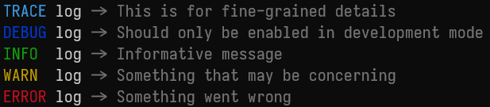
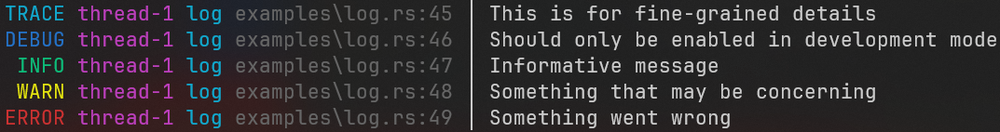
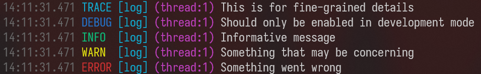
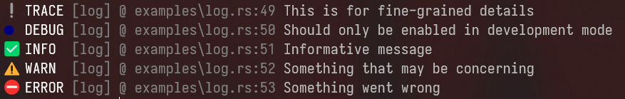

# Traccia 📝

A zero-dependency, all-in-one flexible logging framework for Rust applications.

---

<div style="display: flex; flex-wrap: wrap; gap: 20px;">
  <div style="flex: 1 1 calc(50% - 10px); padding: 5px;">
    
  </div>
  <hr />
  <div style="flex: 1 1 calc(50% - 10px); padding: 5px;">
    
  </div>
  <hr />
  <div style="flex: 1 1 calc(50% - 10px); padding: 5px;">
    
  </div>
  <hr />
  <div style="flex: 1 1 calc(50% - 10px); padding: 5px;">
    
  </div>
</div>

## Overview

This crate provides a configurable logging system that supports multiple output targets, customizable formatting, and different log levels. It can be used in both synchronous (blocking) and asynchronous contexts.

## Features

- **Multiple Log Levels**: Trace, Debug, Info, Warning, Error
- **Flexible Output Targets**: Console, File, and extensible for custom targets
- **Customizable Formatting**: Define your own log message formatting
- **Colored Output**: Terminal-friendly colored output with automatic stripping for files
- **Async & Blocking Modes**: Choose between synchronous or asynchronous logging
- **Thread-Safe**: Designed for concurrent applications
- **Macro-Based API**: Simple, expressive logging interface

## Installation

Add this to your `Cargo.toml`:

```toml
[dependencies]
traccia = "2.2.2"
```

## Quick Start

```rust
use traccia::{init, LogLevel, info, warn, error};

fn main() {
    // Initialize with Info level
    init(LogLevel::Info);

    // Log messages
    info!("Application started");
    warn!("Resource usage high: {}%", 85);
    error!("Connection failed: {}", "timeout");
}
```

## Configuration

### Basic Initialization

```rust
// Initialize with default settings (Info level, Console output)
traccia::init_default();

// Initialize with specific log level
traccia::init(LogLevel::Debug);
```

### Custom Configuration

```rust
use traccia::{Config, LogLevel, File, Console};

// Create a custom configuration
let config = Config {
    level: LogLevel::Debug,
    targets: vec![
        Box::new(Console),
        Box::new(File::new("logs/app.log").unwrap())
    ],
    format: None, // Use default formatter
};

// Initialize with custom config
traccia::init_with_config(config);
```

### Custom Formatter

```rust
use traccia::{Config, Formatter, Record};

struct MyFormatter;

impl Formatter for MyFormatter {
    fn format(&self, record: &Record) -> String {
        format!("{} [{}] {}: {}",
            chrono::Local::now().format("%Y-%m-%d %H:%M:%S"),
            record.level.default_coloring(),
            record.target,
            record.message
        )
    }
}

let config = Config {
    // ...
    format: Some(Box::new(MyFormatter)),
    // ...
};
```

## Usage Examples

### Basic Logging

```rust
trace!("Very detailed information");
debug!("Useful for debugging");
info!("Application progress: step {}", step_number);
warn!("Something potentially problematic happened");
error!("Operation failed: {}", error_message);
fatal!("The program crashed with error: ", error_message);
```

### File Logging

```rust
use traccia::{Config, File, LogLevel, init_with_config};

// Create a file target
let file_target = File::new("logs/application.log").expect("Failed to open log file");

// Configure with file target
let config = Config {
    level: LogLevel::Info,
    targets: vec![Box::new(file_target)],
    format: None, // Use default formatter
};

// Initialize with this config
init_with_config(config);
```

### Multiple Targets

```rust
use traccia::{Config, Console, File, LogLevel, init_with_config};

// Configure with both console and file targets
let config = Config {
    level: LogLevel::Debug,
    targets: vec![
        Box::new(Console),
        Box::new(File::new("logs/debug.log").unwrap()),
    ],
    format: None,
};

init_with_config(config);
```

### Async Logging

This will be the default implementation.
If you wish to change to a blocking logger,
enable the `blocking` feature.

```rust
use traccia::{init_with_config, Config, LogLevel};

fn main() {
    // Initialize as usual
    init_with_config(Config::default_with_level(LogLevel::Info));

    // Log messages
    info!("Async logging enabled");
}
```

## Creating Custom Targets

You can implement the `Target` trait to create custom log destinations:

```rust
use traccia::{Target, Error};

#[derive(Clone)]
struct NetworkTarget {
    endpoint: String,
}

impl NetworkTarget {
    fn new(endpoint: &str) -> Self {
        Self { endpoint: endpoint.to_string() }
    }
}

impl Target for NetworkTarget {
    fn write(&self, formatted: &str) -> Result<(), Error> {
        // Send log to network endpoint
        // ...
        Ok(())
    }
}

// Use it
let config = Config {
    // ...
    targets: vec![Box::new(NetworkTarget::new("https://logs.example.com"))],
    // ...
};
```

## Performance Considerations

- **Blocking vs Async**: Choose the appropriate mode based on your application needs
- **Level Filtering**: Set appropriate log levels in production to minimize overhead
- **Format Complexity**: Complex formatters may introduce additional performance costs

## Integration with Other Libraries

This library is designed to be standalone!

## Contributing

Contributions are welcome! Please feel free to submit a Pull Request.

## License

This project is licensed under the MIT License - see the LICENSE file for details.
